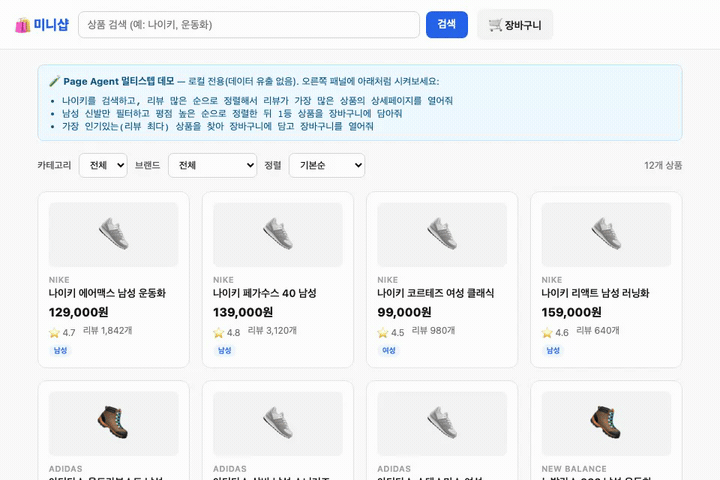

# playwright-mcp — LLM이 브라우저를 스스로 운전하는 Playwright MCP

Claude Code가 브라우저를 **스스로 운전**(navigate·키인·클릭·추출)하게 해주는 Playwright MCP 패키지.
셀렉터 하드코딩 없이, 처음 보는 페이지도 LLM이 스냅샷을 읽고 알아서 조작한다.
의존성은 `@playwright/mcp` 하나뿐.

> **이 가이드는 WSL / 리눅스 환경 기준이다.** (내부 Claude Code가 WSL 안에서 돌아감)
> 명령은 전부 **bash 문법** — PowerShell/cmd 문법(`$env:...`, `set ...`)은 WSL에서 `command not found` 난다.
> 브라우저도 **리눅스 크로미움**이 필요하다. 설치·실행 전부 **WSL 안에서** 한다.

## 데모
자연어 한 줄 → LLM이 **나이키 검색 → 리뷰 많은 순 정렬 → 1등 상품 상세**까지 스스로 조작.



> 위 화면은 동봉된 `page-agent-shop.html`(로컬 전용, 네트워크 0)을 대상으로 한 실제 실행 녹화입니다.

## 전제
- **Node.js 18+** (WSL 안에) — 확인: `node --version`
- **Claude Code** (WSL 안에서 구동)

---

## A. 설치 (WSL에서 npm/CDN 접속 가능할 때) — 한 줄이면 끝
```bash
git clone https://github.com/kay8244/playwright-mcp.git
cd playwright-mcp
npm run setup     # npm install + 리눅스 크로미움 + 자체검증(verify)까지 한 방
claude            # 초록불 뜨면 실행 → playwright MCP approve → 자연어로 조작
```
아래 **초록불**이 뜨면 준비 완료:
```
✅ MCP 기동 — Playwright ...
✅ 툴 노출 — NN 개
✅ navigate — 로컬 페이지 열림 (네트워크 0)
✅ type + click — 키인/클릭 동작
✅ 결과추출 — "나이키" 매칭 N 건
🎉 준비 완료.
```
> 이미 설치된 환경을 다시 확인만 하려면: `npm run verify`

크로미움은 받았는데 **실행이 안 되면**(리눅스 구동 라이브러리 부족):
```bash
sudo npx playwright install-deps chromium
#   또는 한 번에:  sudo npx playwright install --with-deps chromium
```

<details>
<summary>수동으로 단계별 실행하고 싶다면</summary>

```bash
npm install
PLAYWRIGHT_BROWSERS_PATH=0 npx playwright install chromium
node verify.mjs
claude
```
</details>

## B. 폐쇄망 오프라인 (WSL에서 npm/CDN 막힘) — 폴더째 반입
브라우저 바이너리는 **OS 종속**이라, **인터넷 되는 WSL(같은 리눅스 x64) PC에서** 폴더째 만들어 반입한다.
`npm run setup` 은 `PLAYWRIGHT_BROWSERS_PATH=0` 으로 크로미움을 **`node_modules` 안**에 넣으므로,
이 폴더를 통째로 압축해 옮기면 별도 패커 없이 자체완결 번들이 된다.
```bash
# [인터넷 되는 WSL PC]
git clone https://github.com/kay8244/playwright-mcp.git
cd playwright-mcp
npm run setup                       # node_modules 안에 크로미움까지 설치됨
cd ..
tar czf playwright-mcp-offline.tgz --exclude=.git playwright-mcp
#   → 이 .tgz 를 USB / 사내 저장소로 반입

# [폐쇄망 WSL PC]  압축 풀고
tar xzf playwright-mcp-offline.tgz
cd playwright-mcp
npm run verify                      # 네트워크 0 자체검증
claude
```
> ⚠ 준비 PC와 폐쇄망 PC의 **OS/CPU가 같아야** 한다(리눅스 x64 등). 다른 OS에서 받은 크로미움은 못 쓴다.
> 폐쇄망 PC(WSL)에 Node 가 없으면 먼저 설치해 둔다.

## C. 어느 레포에서든 쓰기 — 전역(user 스코프) 등록
기본 설치(A)는 이 폴더 안에서 `claude` 를 켤 때만 붙는다. **한 번만 전역 등록**하면 어느 레포에서든 playwright MCP가 붙는다.

### 한 줄로 — `npm run install-global` (권장)
```bash
cd playwright-mcp
npm run setup            # (아직이면) 초록불까지
npm run install-global   # ~/.claude.json 최상위 mcpServers 에 playwright 를 "안전하게" 추가
```
이 스크립트는 `~/.claude.json` 을 **읽어서 파싱→추가→다시 저장**하므로 손으로 JSON 편집하다 깨질 일이 없다. 이 폴더의 cli.js **절대경로**도 자동으로 넣는다.
- 해제: `npm run uninstall-global`
- 🖥 **브라우저 창을 보고 싶으면(headed)**: 설치 시점의 `DISPLAY` 를 감지해 자동으로 넣는다(WSL은 `echo $DISPLAY` 가 `:0` 등). 그러면 크롬 창이 화면에 뜬다. `DISPLAY` 가 없으면(헤드리스 서버) 안 뜨는 게 정상. WSL에서 안 뜨면 `wsl --shutdown` 후 재접속해 `DISPLAY` 살린 뒤 `npm run install-global` 다시.
- ⚠ **JSON은 최상위 `mcpServers` 에만 넣는다.** `~/.claude.json` 의 `projects.<경로>.mcpServers` 는 프로젝트별이라 **전역 아님**(이 스크립트는 최상위에 넣어줌).

### 등록 후 확인 — ⚠ 반드시 "딴 폴더"에서
```bash
cd ~            # playwright-mcp 폴더가 아닌 아무 폴더
claude
/mcp            # playwright 가 connected 면 전역 성공 🎉  (approve 뜨면 승인)
```
그다음 예: `"https://example.com 열어서 상품 목록 크롤링해서 표로 정리해줘"` → LLM이 브라우저를 스스로 운전한다.

> **왜 딴 폴더?** playwright-mcp 폴더엔 자체 `.mcp.json` 이 있어서, 그 안에서 켜면 전역 것과 **중복→`failed`** 난다. (아래 "중복 주의")

### ⚠️ playwright 는 "한 곳에만" 등록 (중복 = `failed`)
`playwright` 를 **두 군데 이상**(예: 폴더 `.mcp.json` + `~/.claude.json`)에 정의하면 충돌해 `/mcp` 에 **`failed`** 로 뜬다. `failed` 뜨면:
1. **중복부터 의심** — 한 곳만 남기고 지운다. (제일 흔한 원인)
2. 그래도면 서버가 못 뜨는 것 → 그 폴더에서 `npm run verify` 로 원인(브라우저 미설치 등) 확인.

<details>
<summary>수동 방법 (스크립트 못 쓸 때) — CLI / 설정파일 / 레포별</summary>

**CLI (일반 환경)** — 사내 wrapper 환경에선 `sh: Syntax error` 로 막힐 수 있음:
```bash
claude mcp add playwright --scope user -e PLAYWRIGHT_BROWSERS_PATH=0 -- node "$PWD/node_modules/@playwright/mcp/cli.js" --isolated --allow-unrestricted-file-access
```

**레포별 `.mcp.json`** — 전역이 계속 막히면, 쓰려는 레포 루트에 이 파일 하나만 두기(절대경로):
```json
{
  "mcpServers": {
    "playwright": {
      "command": "node",
      "args": [
        "/home/사용자/playwright-mcp/node_modules/@playwright/mcp/cli.js",
        "--isolated",
        "--allow-unrestricted-file-access"
      ],
      "env": { "PLAYWRIGHT_BROWSERS_PATH": "0" }
    }
  }
}
```
> 경로는 실제 절대경로로 교체. **한 곳에만** — `~/.claude.json` 에도 동시에 넣으면 중복 충돌.
</details>

> - ⚠ 이 폴더를 **지우거나 옮기지 말 것** — 브라우저가 그 안 `node_modules` 에 있고 등록이 그 절대경로를 가리킨다. 옮겼으면 `npm run install-global` 다시.
> - 💡 사내 배포판(wrapper)에서 `claude` 실행 때마다 뜨는 `sh: Syntax error` 배너는 대개 **노이즈**다 — claude 채팅 화면이 열리고 `/mcp` 가 뜨면 정상 동작하는 것.

---

## 직접 시켜보기 (approve 후 자연어로)
```
page-agent-shop.html 열어서 나이키 검색하고 리뷰 많은 순 1등 상품 상세페이지 열어줘
```
```
방금 그 페이지에서 상품명과 가격만 뽑아서 표로 정리해줘
```
→ LLM이 `browser_navigate / browser_snapshot / browser_type / browser_click` 을 알아서 호출한다.

## 반복 작업 빠르게 — 결정적으로 "굳히기" (`crawl.mjs`)
에이전트형 MCP는 매번 **LLM이 화면을 새로 분석**해서 느리다. **매일/반복되는 똑같은 작업**이면
분석을 아예 없애고 **고정 셀렉터 스크립트로 재생**하면 수 초 만에 끝난다(분석 0, 재현·감사 가능).

| | 에이전트형 (MCP) | 결정적 (`crawl.mjs`) |
|---|---|---|
| 방식 | LLM이 매번 보고 판단 | 셀렉터 고정, 그대로 재생 |
| 속도 | 느림(단계마다 분석) | **수 초, 분석 0** |
| 적합 | 처음 보는 페이지·탐색·일회성 | **매일/반복·감사 필요** |

**실전 흐름: MCP로 찾고 → 결정적으로 굳히기**
1. 흐름은 MCP로 한 번만 탐색(어떤 입력칸/버튼을 거치는지)
2. 그 셀렉터를 `crawl.mjs` 의 `crawl(page)` 함수에 박아 이후엔 재생만:

```bash
npm run crawl                                   # 기본: 동봉 미니샵 데모 → crawl-result.json
node crawl.mjs --url "https://..." --out out.json
node crawl.mjs --headed                          # 화면 보며 디버깅(WSL은 GUI 필요)
node crawl.mjs --auth auth.json                  # 로그인 세션 재사용
```
> - **다른 사이트로 바꾸기**: `crawl.mjs` 의 `crawl(page)` 함수만 대상에 맞게 수정한다.
> - **셀렉터 찾기**: MCP가 조작할 때 쓴 셀렉터를 받거나, `npx playwright codegen <URL>`
>   (클릭할 때마다 코드 자동 생성 — WSL은 GUI 필요).
> - 결과는 `crawl-result.json` 에 JSON 으로 저장(`.gitignore` 처리됨).

## 옵션 (`.mcp.json` 의 args)
| 목적 | 방법 |
|---|---|
| 화면 보며 실행(headed) | 기본 headed. 무인이면 `"--headless"` 추가 |
| **사내 로그인 유지**(SSO/키인) | `"--isolated"` 빼고 `"--storage-state","auth.json"` 추가 |
| 특정 사내 도메인만 허용 | `"--allowed-origins","https://사내앱.도메인"` 추가 |

> **auth.json**(세션 재사용): 로그인 가능한 환경에서 한 번
> `npx playwright codegen --save-storage=auth.json <URL>` → 생성 파일을 이 폴더에 두고 위 옵션 켜기.
> (`auth.json` 은 로그인 토큰이라 `.gitignore` 처리됨 — git 에 올라가지 않는다.)

## 파일
- `.mcp.json` — Claude Code용 MCP 설정. **절대경로 없음**, `env`로 `PLAYWRIGHT_BROWSERS_PATH=0`
- `setup.mjs` — 원커맨드 부트스트랩(install→크로미움→verify). `npm run setup` 으로 호출
- `verify.mjs` — 자체검증(navigate→키인→클릭→결과추출, 네트워크 0)
- `crawl.mjs` — 결정적 크롤러(반복 작업 굳히기). `npm run crawl` 으로 호출
- `install-global.mjs` — 전역 등록(`~/.claude.json` 최상위 mcpServers에 안전 추가). `npm run install-global`
- `page-agent-shop.html` — 데모/검증 대상 페이지
- `package.json` — `@playwright/mcp@0.0.78` 고정

## 트러블슈팅
| 증상 | 원인 / 해결 |
|---|---|
| `$env:...` / `set ...` 에서 `command not found` | WSL(리눅스)인데 Windows 셸 문법을 씀. 이 가이드의 **bash 명령**을 쓸 것 |
| `node: command not found` | WSL에 Node 18+ 미설치 → 설치 후 재시도 |
| `npm run setup` 이 크로미움 다운로드에서 멈춤 | CDN 차단(폐쇄망). 위 **B** 경로로 반입 |
| 크로미움은 받았는데 브라우저 실행 실패 | 리눅스 구동 라이브러리 부족 → `sudo npx playwright install-deps chromium` |
| verify 초록불이 안 뜨고 `[mcp]` 에러 | `node_modules/@playwright/mcp` 손상 → `npm install` 다시. 로그의 `[mcp]` 줄 확인 |
| `claude` 시작 시 playwright MCP 가 안 보임 | 이 폴더 안에서 `claude` 를 실행했는지 확인(`.mcp.json` 이 여기 있음) |
| approve 했는데 "브라우저 없음" | Windows에서 설치한 브라우저는 WSL이 못 찾음. **설치·실행 전부 WSL에서**, `npm run verify` 통과 확인 |
